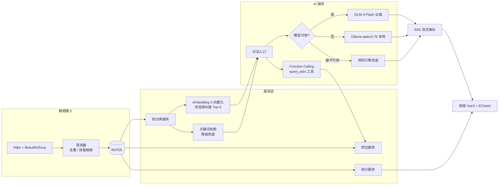

# AI 招聘数据可视化系统（Python 重构版）

> 毕业设计《AI 招聘数据可视化系统的开发与设计》的 Python / FastAPI 重构实现。
> Java 原版见：`github.com/zanboring/Recruitment`

## 一、项目简介

面向招聘数据分析场景的全栈后端系统，覆盖 **数据采集 → 清洗入库 → 统计分析 → 可视化接口 → AI 智能服务** 完整链路。

本仓库是毕设的 **Python 重构版**：用 FastAPI + SQLAlchemy 2.0 异步 ORM 重写后端，保留全部业务能力，并强化了 AI 服务、知识库检索与推荐模块。

**规模**：8 个路由模块 / 56 个 REST 接口 / 10 个业务服务 / 6 张数据表

## 二、技术栈

| 层 | 技术 |
|---|---|
| Web 框架 | FastAPI 0.115 + Uvicorn |
| ORM / 数据库 | SQLAlchemy 2.0（asyncio）+ aiomysql + MySQL |
| 数据校验 | Pydantic 2.9 + pydantic-settings |
| 认证 | JWT（python-jose）+ passlib/bcrypt |
| 定时任务 | APScheduler 3.10 |
| 爬虫 | httpx + BeautifulSoup4 + lxml + Playwright |
| AI 接入 | httpx 流式调用（云端 GLM-4-Flash / 本地 Ollama） |
| 向量化 | 智谱 embedding-3 |

## 三、系统架构



## 四、目录结构

```
recruitment-python/
├── app/
│   ├── main.py              # FastAPI 应用入口（注册 8 个路由、CORS、生命周期）
│   ├── config.py            # pydantic-settings 配置（全部走环境变量）
│   ├── database.py          # 异步引擎与会话工厂
│   ├── scheduler.py         # APScheduler 定时爬取
│   ├── init_data.py         # 建表 + 初始化数据
│   ├── routers/             # 8 个路由模块（56 个接口）
│   │   ├── auth.py          #   4  认证
│   │   ├── jobs.py          #   20 岗位 / 统计 / 导出
│   │   ├── ai.py            #   5  AI 对话
│   │   ├── model.py         #   6  模型配置管理
│   │   ├── knowledge.py     #   10 知识库
│   │   ├── crawler.py       #   3  爬取任务
│   │   ├── user.py          #   5  用户管理
│   │   └── log.py           #   3  系统日志
│   ├── services/            # 10 个业务服务
│   │   ├── ai_service.py           # 三级降级 + SSE + 工具调用调度
│   │   ├── tool_service.py         # Function Calling 工具定义与执行
│   │   ├── embedding_service.py    # 向量化与余弦相似度
│   │   ├── knowledge_service.py    # 语义检索 + 关键词降级
│   │   ├── local_model_service.py  # 规则引擎兜底
│   │   └── ...                     # auth / crawler / export / job / model
│   ├── models/              # 6 个 SQLAlchemy 模型
│   ├── schemas/             # 6 组 Pydantic Schema
│   ├── crawlers/            # BaseCrawler 抽象类 + BossCrawler + 清洗器
│   ├── recommender/         # Jaccard 相似度 + 薪资预测 + 多因子分析
│   └── utils/               # 日志装饰器、安全工具
├── scripts/
│   └── init_db.py           # 建表 + 初始化管理员
├── tests/                   # 33 个单元测试（49 条断言）
├── _archive/                # 开发过程文档（审计报告 / 提示词，不进仓库逻辑）
└── requirements.txt
```

## 五、模块说明

### 1. AI 服务（ai.py 5 个 + model.py 6 个接口）

- **三级降级链**：云端 GLM-4-Flash → 本地 Ollama（qwen2:7b）→ 规则引擎兜底，任一后端不可用时自动降级，保证服务不中断
- **SSE 流式输出**：httpx 流式响应 + `EventSourceResponse`，前端打字机效果
- **Function Calling（工具调用）**：用户问「长沙有多少 Java 岗位」时，模型判断需要查库并输出结构化工具调用，代码执行 `query_jobs` 查询真实岗位数据，再把结果回填给模型组织自然语言回答。采用「prompt 引导 + JSON 解析」实现，不依赖具体模型的 native tool calling（见 `app/services/tool_service.py`）
- **会话管理**：支持会话取消、最大会话数 1000、单会话保留最近 20 条历史
- **模型管理**：6 个接口，支持模型配置的增删改查与启用切换

### 2. 知识库（knowledge.py 10 个接口）

- **语义向量检索（RAG）**：用智谱 `embedding-3` 把查询与知识条目向量化，按余弦相似度取 Top-5 注入 AI 上下文，能把「工资多少」和「薪资水平」这类语义相近但字面不同的问题关联起来（见 `app/services/embedding_service.py`）
- **关键词降级**：向量化不可用（无 API Key / 网络失败 / 接口报错）时自动回退到关键词检索（43 个关键词打标签 + 精确匹配 Top-3 / 模糊匹配 Top-5），保证服务不中断
- **缓存**：检索结果缓存 600 秒、单条文本向量缓存 1 小时，降低重复调用成本
- **质量门槛**：`learn_from_response` 对回答做质量校验，长度 < 20 字不入库，避免脏数据回流

### 3. 数据采集与清洗

- **抽象基类 `BaseCrawler`**：统一调度、限速、重试、去重流程，`BossCrawler` 继承实现平台解析
- **反爬策略**：10 个 User-Agent 轮换、请求间隔 12–18 秒随机延时、失败后 4 次指数退避重试
- **清洗规则**：9 个高级词 / 10 个无效词过滤规则，68 项技能词典抽取
- **去重**：SHA-256 对岗位指纹去重，避免重复入库

### 4. 智能推荐

- **Jaccard 相似度**：岗位技能集合与候选人技能集合求交并比；**技能归一化**：把「Java开发」「Spring Boot」「Vue.js」等变体统一为规范名，提升字面不同但语义相同的技能匹配率（见 `app/recommender/jaccard.py`）
- **规则薪资预测**：9 档城市 × 6 档经验 × 4 档学历 交叉系数 + 技能溢价（≤15%），独立于推荐打分
- **多因子加权**：技能相似度 0.7 + 学历匹配 0.2 + 经验匹配 0.1，候选池上限 500

### 5. 认证与权限

- JWT Token，有效期 24 小时
- 角色区分 ADMIN / USER，登录失败次数锁定

### 6. 数据可视化

- 后端提供 7 个维度的统计聚合接口
- 前端（Vue3 + ECharts，在 Java 版仓库）：饼图 3 个 / 柱状图 10+ 个 / 折线图 1 个 / 雷达图 1 个

## 六、快速开始

```bash
# 1. 安装依赖
pip install -r requirements.txt

# 2. 配置环境变量（见 ENV_CONFIG.md）
cp .env.example .env
#    至少设置：MySQL 连接、JWT 密钥
#    可选：ZHIPUAI_API_KEY（不填则 AI 走本地 Ollama / 规则引擎）

# 3. 初始化数据库（自动建表 + 插入默认管理员 admin/admin123）
python scripts/init_db.py

# 4. 启动服务
uvicorn app.main:app --reload --host 0.0.0.0 --port 8000

# 5. 访问接口文档
#    http://localhost:8000/docs
```

## 七、测试

```bash
python -m pytest tests/ -v
```

| 文件 | 用例数 | 覆盖内容 |
|---|---|---|
| `test_embedding_service.py` | 10 | 余弦计算、结果排序、向量缓存、分块批量、无 Key 降级 |
| `test_jaccard.py` | 12 | 技能归一化、别名映射、Jaccard 计算、边界情况 |
| `test_tool_service.py` | 11 | 工具调用 JSON 提取、嵌套括号、参数解析、未知工具处理 |

## 八、与 Java 版的对比

| 维度 | Java 版 | 本版（Python） |
|---|---|---|
| 框架 | Spring Boot 3.2.5 + Java 21 | FastAPI 0.115 + Python 3 |
| ORM | MyBatis + PageHelper | SQLAlchemy 2.0 异步 |
| 爬虫 | WebMagic + ParserFactory 工厂模式（4 平台） | BaseCrawler 抽象 + BossCrawler |
| AI 接入 | 同步调用 | httpx 流式 + SSE + 三级降级 |
| 知识库 | 关键词检索 | 语义向量检索 + 关键词降级 |
| 工具调用 | 无 | Function Calling（`query_jobs`） |
| 日志 | AOP 切面 + `@Log` 注解 | 装饰器 |
| 权限 | Spring Security + JWT | 手动 JWT 中间件 |
| 并发 | 线程池 | asyncio 原生异步 |

详细的双栈对比见 `java_vs_python_comparison.md`，迁移说明见 `MIGRATION_GUIDE.md`。

## 九、说明

- 数据库建表与初始化数据见 `app/init_data.py`
- 前端代码在 Java 版仓库 `Recruitment/recruitment-system-frontend`，本仓库只提供后端接口
- `_archive/` 目录下是开发过程文档（代码审计报告、提示词记录），不参与项目运行
