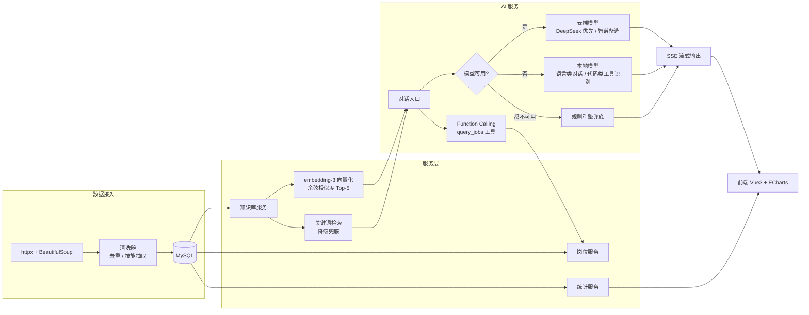

# AI 招聘数据可视化系统（Python 重构版）

> 求职作品定位、运行约束与下一步开发请先阅读 [AI_APPLICATION_HANDOFF.md](AI_APPLICATION_HANDOFF.md)。生产部署必须设置 `APP_ENV=production` 和强随机 `JWT_SECRET`。

> 毕业设计《AI 招聘数据可视化系统的开发与设计》的 Python / FastAPI 重构实现。
> Java 原版见：`github.com/zanboring/Recruitment`

## 一、项目简介

面向招聘数据分析场景的全栈后端系统，覆盖 **数据采集 → 清洗入库 → 统计分析 → 可视化接口 → AI 智能服务** 完整链路。

本仓库是毕设的 **Python 重构版**：用 FastAPI + SQLAlchemy 2.0 异步 ORM 重写后端，保留全部业务能力，并强化了 AI 服务、知识库检索与推荐模块。

**规模**：10 个路由模块 / 90+ 个 REST 接口（含 21 个 Java 版前端兼容接口）/ 14 个业务服务 / 8 张数据表 / 459 项自动化测试

## 二、技术栈

| 层 | 技术 |
|---|---|
| Web 框架 | FastAPI 0.115 + Uvicorn |
| ORM / 数据库 | SQLAlchemy 2.0（asyncio）+ aiomysql + MySQL |
| 数据校验 | Pydantic 2.9 + pydantic-settings |
| 认证 | JWT（python-jose）+ passlib/bcrypt |
| 数据库 | MySQL / PostgreSQL / SQLite 三库可切（SQLAlchemy 2.0 异步） |
| 缓存 | Redis（可选，失败自动降级内存缓存） |
| 定时任务 | APScheduler 3.10 |
| 爬虫 | httpx + BeautifulSoup4 + lxml + Playwright |
| AI 接入 | OpenAI 兼容协议：DeepSeek / 智谱可配置切换（多供应商容灾）+ 本地 Ollama 双模型分工 |
| 向量化 | 云端 embedding-3 / 本地 Ollama 可切换（auto 自动选择） |

## 三、系统架构



## 四、目录结构

```
recruitment-python/
├── app/
│   ├── main.py              # FastAPI 应用入口（注册 8 个路由、CORS、生命周期）
│   ├── config.py            # pydantic-settings 配置（全部走环境变量）
│   ├── database.py          # 异步引擎与会话工厂
│   ├── scheduler.py         # APScheduler 定时爬取
│   ├── init_data.py         # 建表 + 初始化数据
│   ├── routers/             # 11 个路由模块（95 个 API 端点，含 compat.py 兼容层）
│   │   ├── auth.py          #   4  认证
│   │   ├── jobs.py          #   20 岗位 / 统计 / 导出 / 导入
│   │   ├── ai.py            #   5  AI 对话
│   │   ├── model.py         #   6  模型配置管理
│   │   ├── knowledge.py     #   12 知识库
│   │   ├── crawler.py       #   3  爬取任务
│   │   ├── report.py        #   6  自动化日报（生成 / 列表 / 详情 / 下载 / 推送）
│   │   ├── system.py        #   2  版本自证 + 检查更新
│   │   ├── user.py          #   5  用户管理
│   │   ├── log.py           #   3  系统日志
│   │   └── compat.py        #   21 Java 版前端兼容层（别名路由）
│   ├── services/            # 21 个业务服务
│   │   ├── ai_service.py           # 三级降级 + SSE + 工具调用调度
│   │   ├── react_agent.py          # ReAct 多步推理 Agent（Thought→Action→Observation 循环）
│   │   ├── llm_client.py           # 云端统一调用层（OpenAI 兼容 + 多供应商容灾）
│   │   ├── ollama_client.py        # 本地统一调用层（按角色路由两个本地模型）
│   │   ├── tool_service.py         # Function Calling 工具定义与执行
│   │   ├── embedding_service.py    # 向量化与余弦相似度
│   │   ├── knowledge_service.py    # 语义检索 + 关键词降级
│   │   ├── report_service.py       # 日报聚合 / Excel 透视 / 推送编排
│   │   ├── webhook_service.py      # 企业微信 / 钉钉 / 通用 Webhook 推送
│   │   ├── update_service.py       # 检查 GitHub Release 是否有新版本
│   │   ├── local_model_service.py  # 规则引擎兜底
│   │   ├── usage_service.py        # Token 用量与成本统计
│   │   └── ...                     # auth / crawler / export / job / model
│   ├── models/              # 8 个 SQLAlchemy 模型（含 ai_usage 用量表、daily_report 日报表）
│   ├── schemas/             # 6 组 Pydantic Schema
│   ├── crawlers/            # BaseCrawler + boss / job51 平台爬虫 + 注册表 + 节流配额 + robots 门禁
│   ├── recommender/         # Jaccard 相似度 + 薪资预测 + 多因子分析
│   ├── evaluation/          # RAG 检索效果评估（黄金集 + 指标 + 多策略对比）
│   ├── middleware/          # 滑动窗口限流、请求上下文、camelCase 字段兼容
│   └── utils/               # 日志装饰器、job_key 指纹、安全与时间工具
├── scripts/
│   ├── init_db.py           # 建表 + 初始化管理员
│   ├── eval_rag.py          # RAG 检索效果评估入口
│   └── bench_local_models.py# 本地模型能力对比基准（决定模型分工）
├── userscript/              # 油猴脚本采集通道（真实浏览器采集 + 回传本地服务）
├── collab/                  # 双 AI 协作信道（收件箱 + 状态/冲突检查器）
├── reports/                 # 评估报告输出（rag_evaluation.md、local_model_benchmark.md）
├── tests/                   # 459 个单元测试
├── _archive/                # 开发过程文档（审计报告 / 提示词，不进仓库逻辑）
└── requirements.txt
```

## 五、模块说明

### 1. AI 服务（ai.py 5 个 + model.py 7 个接口）

- **三级降级链**：云端模型（DeepSeek 优先 → 智谱备选）→ 本地模型（按角色分工，见下）→ 规则引擎兜底，
  任一后端不可用时自动降级，保证服务不中断
- **多供应商容灾**：云端候选是一个**有序列表**（由 `AI_PROVIDER` 决定优先级），
  任一服务商密钥过期或额度用尽都会自动尝试下一个；接入任意 OpenAI 兼容厂商
  （Moonshot、通义、SiliconFlow…）只需加一行配置，调用方代码零改动
  （统一实现在 `app/services/llm_client.py`）
- **本地模型按角色分工**（`app/services/ollama_client.py`）：本地不是「一个备胎」，
  而是把两个能力互补的模型各放到它更擅长的那一环 ——

  | 角色 | 模型 | 配置项 | 实测依据 |
  |---|---|---|---|
  | 对话生成 | `qwen2.5:14b`（语言类 14.8B） | `OLLAMA_MODEL` | 知识问答 3/3 通过 |
  | 工具识别 / JSON 抽取 | `qwen2.5-coder:7b`（代码类 7.6B） | `OLLAMA_CODE_MODEL` | 准确率同为 100%，耗时更低（5.4s vs 7.4s）|

  分工结论不是靠感觉，而是用 `scripts/bench_local_models.py` 实测得出（报告见
  `reports/local_model_benchmark.md`）：两个模型做**工具识别**准确率完全相同（6/6），
  但小的那个明显更快；做**知识问答**时大的那个更可靠。因此机械的抽取环节交给小模型、
  需要表达与事实准确性的环交给大模型。本地链路耗时拆解：工具识别 6.1s + 查库 0.01s +
  生成 22.2s ≈ 28.4s，瓶颈在生成而非路由。
- **本地 Function Calling**：降级到本地后「查库」能力不失效 —— 本地路径同样执行
  「工具识别 → 查库 → 结果回填」，与云端共用同一套提示词与解析器
  （`ollama_client.detect_tool_call` 复用 `tool_service`），区别只在由哪个模型来读。
- **不盲信配置**：健康探测除了查服务可达，还会核对配置的模型是否真的 `pull` 过。
  这是本项目真实踩过的坑 —— 配置写 `qwen2:7b` 而本机装的是 `qwen2.5:14b`，
  旧逻辑只要 `/api/tags` 返回 200 就报「已就绪」，直到调用时 404 并被静默降级。
  现在会在状态页如实标注缺失的模型并给出 `ollama pull` 提示。
- **可切换为选项**：`POST /api/model/switch` 支持 `auto` / `primary` / `local` /
  `local_code`，也可直接指定任意**已安装**的模型名（未安装会被拒绝并提示现有清单）。
  偏好是全局的，`/api/ai/chat-stream` 与 `/api/model/chat` 两条入口都生效。
- **工具识别有廉价前置过滤**：朴素实现对**每条**消息都发起一次「是否需要查库」的
  LLM 调用（实测本机约 2.9s，云端则多一批 token），而大量消息本就不涉及数据库。
  过滤规则刻意保守 —— **只在「消息很短且不含任何领域信号」时跳过**，因为漏判的
  代价是「模型凭空编数字」（硬伤），多判的代价只是白花一次调用。可用
  `AI_TOOL_PREFILTER_ENABLED=false` 一键回退。
- **Token 用量与成本可观测**（`app/services/usage_service.py` + `GET /api/model/usage`）：
  每次 LLM / 向量化调用都记录 token、耗时、降级层级与失败原因，落 `ai_usage` 表，
  按场景 / 模型 / 服务商 / 降级层级 / 日期聚合，并按单价折算费用。这回答了三个问题：

  | 问题 | 看哪个字段 |
  |---|---|
  | 花了多少 | `totals.cost` / `totals.total_tokens` |
  | 贵在哪 | `by_scene`（对话 / 工具识别 / 分析报告 / 向量化）与 `by_model` |
  | 降级生效了吗 | `by_tier` 里 local / fallback 的占比；失败调用也留痕 |

  两条设计取舍：**写入失败绝不影响业务**（异常一律吞掉只记日志）；**费用在写入时
  算好并落库**（单价会变，历史记录应按当时价计价）。本地模型计 0 元，同时折算
  出「省下多少云端调用」（`totals.saved_cost_estimate`）。
- **知识库自动入库是可关的**：每次问答都会把回答沉淀进知识库，形成
  「AI 生成内容 → 被当作知识召回 → 再次喂给 AI」的闭环，答错时错误会被固化并
  反复出现。因此自动入库条目记录**真实来源**（模型名，便于与人工内容区分），
  并提供 `AI_AUTO_LEARN_ENABLED=false` 总开关。
- **输出长度有硬上限**：原实现不给云端请求传 `max_tokens`，本地对话也不传
  `num_predict`（Ollama 默认 `-1` = 不限），单次回答长度没有任何上界 ——
  按 token 计费的云端成本不可控，本地模型（实测 12 tok/s）一次回答足以让用户等上
  几分钟。现在按场景分级设限：工具识别 128（只需一行 JSON）/ 对话 1024 /
  分析报告 2048，配置见 `AI_MAX_OUTPUT_TOKENS` 等三项。
- **SSE 流式输出**：httpx 流式响应 + `EventSourceResponse`，前端打字机效果。
  除正文分片外还发两个**具名事件**（对正文是纯增量，不认识它们的客户端会自动忽略）：
  - `event: sources` —— 本轮命中的知识库条目（id / 问题 / 来源 / 质量分），
    在正文之前发出。回答「怎么防止模型胡说」：不是让模型承诺不说谎，而是让**依据可核查**；
  - `event: meta` —— 本轮实际用的 provider / model / 降级层级 / token / 耗时，
    在流结束后发出。前端据此显示「本次由规则引擎回答」，用户才知道自己看到的是降级结果。

  正文仍保持原有的裸 `data:` 分片格式，避免已上线的客户端出现乱码。

  **知识库检索在降级链之外只做一次**：检索结果与「最终用哪个模型回答」无关。
  曾把它写在每一级的内部，于是「云端失败 → 本地重试」会重复检索 —— 实测一次提问
  触发 3 次，导致 `usage_count` 被虚增 3 倍（该字段参与知识条目质量排序，属数据污染），
  `on_sources` 被回调 3 次（前端展示出 3 条相同的引用来源）。
- **Function Calling（工具调用）**：用户问「长沙有多少 Java 岗位」时，模型判断需要查库并输出结构化工具调用，代码执行 `query_jobs` 查询真实岗位数据，再把结果回填给模型组织自然语言回答。采用「prompt 引导 + JSON 解析」实现，不依赖具体模型的 native tool calling（见 `app/services/tool_service.py`）
- **ReAct 多步推理 Agent**（`app/services/react_agent.py` + `POST /api/ai/agent-stream`）：单步 Function Calling 只查一次，而复合问题（「先看长沙 Java 岗位多不多 → 再看薪资分布 → 再要推荐」）需要多回合。ReAct Agent 让模型在 `Thought → Action → Observation` 循环中逐步推理，每步执行一个工具、把观察结果回填、再决定下一步，直到输出 `Final Answer`。三个工具：`query_jobs`（岗位统计）、`recommend_jobs`（Jaccard 相似度推荐）、`get_city_stats`（城市分布）。硬约束：`agent_max_steps` 步数上限 + 无 Final Answer 时强制收尾，绝不无限循环；每步推理过程通过 `agent_step` / `agent_observation` 事件流透出，回答可解释、可核查。降级链与普通对话一致（云端 → 本地 Ollama → 规则引擎）
- **会话管理**：支持会话取消、最大会话数 1000、单会话保留最近 20 条历史
- **模型管理**：7 个接口（含 `GET /api/model/usage` 用量成本统计），支持模型配置的增删改查与启用切换

### 2. 知识库（knowledge.py 12 个接口）

- **语义向量检索（RAG）**：用云端 `embedding-3`（或本地 Ollama 向量模型）把查询与知识条目向量化，按余弦相似度取 Top-5 注入 AI 上下文，能把「工资多少」和「薪资水平」这类语义相近但字面不同的问题关联起来（见 `app/services/embedding_service.py`）
- **关键词降级**：向量化不可用（无 API Key / 网络失败 / 接口报错）时自动回退到关键词检索（43 个关键词打标签 + 精确匹配 Top-3 / 模糊匹配 Top-5），保证服务不中断
- **缓存**：检索结果缓存 600 秒、单条文本向量缓存 1 小时，降低重复调用成本
- **质量门槛**：`learn_from_response` 对回答做质量校验，长度 < 20 字不入库，避免脏数据回流

### 3. 数据采集与清洗

- **抽象基类 `BaseCrawler`**：统一调度、限速、重试、去重流程，各平台爬虫继承实现自己的解析
- **已接入平台**：`boss`（BOSS 直聘）、`51job`（前程无忧）。
  平台标识 → 爬虫类收敛在 `app/crawlers/registry.py`，`SUPPORTED_PLATFORMS` 由注册表派生 ——
  此前它写死在服务层（`{"boss"}`）且实例化也硬编码，新增平台时容易漏登记，
  接口会把新平台误判为「未实现」。新增平台现在只需在注册表加一行。
- **反爬策略**：10 个 User-Agent 轮换、完整浏览器请求头（UA 与 Sec-CH-UA 平台协变，
  只换 UA 仍会被识别为自动化）、请求间隔 12–18 秒随机延时、失败后 4 次指数退避重试、
  风控信号（429 / 验证码 / 滑块）检测后自适应放大延迟
- **51job 实现要点**（`app/crawlers/job51.py`）：
  - 走 51job 前端自用的搜索接口取 JSON，而不是解析 HTML —— 该站搜索结果页是前端渲染的，
    抓 HTML 只会得到「看起来正常但永远为空」的静默失败
  - 接口字段用别名表兜住版本差异；取不到岗位数组时返回 `None`，
    让调用方区分「响应结构变了」与「这页真的没有岗位」
  - 薪资写法比 BOSS 杂得多（`1-1.5万` / `8千-1.2万` / `15-25万/年` / `1-1.5万·13薪`），
    有独立解析器并统一折算为月薪；日薪、时薪、面议一律留空，不换算假数据
  - 城市编码取自 51job 搜索页 URL 的 `jobArea` 参数，经三个独立公开来源交叉核对一致
- **采集通道（三种，按抗封能力递增）**：

  | 通道 | 原理 | 抗封 | 适用 |
  |---|---|---|---|
  | 无头浏览器（服务端，`app/crawlers/`） | Playwright 起 chromium，带完整请求头与代理 | 中 | 批量历史采集、定时全量 |
  | **油猴脚本（已实现，`userscript/`）** | 在用户真实浏览器里采集，复用登录态与真实指纹 | **最高** | 按需采集、登录后可见的数据 |

  油猴通道（`userscript/recsys-collector.user.js`）的要点：
  - 回传走 **`GM_xmlhttpRequest`** —— 它是特权 API，**不受同源策略限制**；
    这正是「用前端代码采集」唯一能跑通的路子（纯页面 JS 被 CORS 死锁，见下）；
  - 请求发自真实浏览器 → **不存在「集中 IP 访问」这个特征**，也就没有被封的触发条件；
  - 脚本只做**哑采集器**：只取 DOM 原始文本，`job_key` / 薪资解析 / 技能抽取 / 过滤
    全部留在服务端，否则两个采集入口的口径必然漂移；
  - **不触发下架判定**：浏览器采集是部分数据，拿它判断「哪些岗位没再出现」
    会把库里其它岗位整批误判下架（爬虫按「关键词 × 城市」系统性抓取，才可以判断）；
  - 服务端入口 `POST /api/crawler/ingest` **默认关闭**（未配 `BROWSER_COLLECT_TOKEN`
    即返回 403），且用**自定义请求头**携带令牌 —— 自定义头会触发跨源预检，
    普通网页拿不到预检许可，于是根本发不出这个请求；
  - 脚本提供**预览**模式（只识别不发送，并告诉你本次是用哪个选择器 / 兜底方式定位到卡片），
    站点改版时先点它；
  - 已支持 **4 个站点**：BOSS直聘 / 前程无忧 / 智联招聘 / 猎聘。
    其中智联与猎聘**服务端没有写爬虫**——这不矛盾：浏览器采集不需要服务端有对应爬虫，
    数据是用户在真实浏览器里取好回传的。因此这里区分两个集合：
    **已知平台**（`KNOWN_PLATFORMS`，4 个，浏览器通道都收）与
    **爬虫已实现平台**（`SUPPORTED_PLATFORMS`，2 个，只有这些能「启动爬取任务」）。
    两者各有用例锁住，另有一条**跨产物契约测试**：脚本声明的 platform 必须在后端已知集合里。

  **关于「用前端代码直接爬取」的可行性**：纯页面内 JS（控制台 / 书签脚本）
  **不可行** —— 同源策略与 CORS 会拦掉跨域 `fetch`，而 `mode: 'no-cors'`
  虽然能发出请求，拿到的却是 **opaque 响应，读不到任何内容**（JSONP 现代站点早已不提供）。
  真正可行的是**浏览器扩展 / 油猴脚本**：扩展在 `manifest.json` 里声明
  `host_permissions`，**不受 CORS 限制**，且天然运行在真实登录态与真实指纹里 ——
  这是从原理上规避「IP 被封 / 被识别为自动化」的最优解，
  因为根本不存在「集中 IP 访问」这个特征。
- **两层的采集护栏**（``BaseCrawler`` 管「一次爬取内部」，``app/crawlers/throttle.py`` 管「任务之间」）：

  | 层 | 机制 | 解决什么 |
  |---|---|---|
  | 组内 | 随机延时 12–18s、指数退避 + 抖动、风控信号检测后自适应放大延迟、完整浏览器请求头 | 单次爬取不要打太快 |
  | **跨任务** | **同一域名串行 + 最小间隔**（`CRAWL_DOMAIN_MIN_INTERVAL`） | 两个任务**同时**打同一域名（只加延迟挡不住，必须串行） |
  | **跨任务** | **单平台日配额**（`CRAWL_DAILY_QUOTA_PER_PLATFORM`，按北京日期计） | 「今天这个平台最多访问多少次」这个最基本的运维问题 |
  | **跨任务** | **robots.txt 合规门禁**（按域名缓存 1 小时） | 合规；缓存是因为每个任务都去拉一次 robots.txt 本身就是额外流量且模式可疑 |
  | **跨任务** | **尊重 `Retry-After`**（秒数与 HTTP 日期两种格式都解析） | 被 429 时听对方要求的等待时长，而不是自己拍脑袋退避 |
  | 节奏 | 定时任务**打乱组合顺序 + 组间随机间隔 2–6 分钟** | 18 组背靠背连跑、每天同一时刻访问同一批城市，流量形状过于规律 |

  若干设计取舍（都写进了代码注释，也是面试可讲的点）：

  - **域名节流为什么必须串行**：只加延迟的话，两个任务仍会各自「等够时间」后同时发请求，
    对站点来说并发依然是 2。串行才能保证同一域名同一时刻只有一个请求在飞；
  - **日配额超限为什么直接失败**：`0 条` 和「被配额拦下」是两回事，
    后者必须写进任务 message，否则又是「已完成为 0 条」那种无从排查的状态；
  - **robots 默认「只告警不阻断」是刻意取舍**：默认阻断会让人撞上
    「配置全对却一个任务也跑不起来」，且分不清是自己配错还是站点不允许。
    需要硬门禁时设 `CRAWL_ROBOTS_STRICT=true`。**无论哪种模式，命中 Disallow 都会记 WARNING
    并写进任务 message，绝不静默通过**；
  - **被 429 时不原地 sleep 等 `Retry-After`**：该值可能是几分钟甚至一小时，
    让后台任务挂着不如直接收工交给下一轮定时任务 —— 等待期间我们不再发任何请求，
    语义上同样是尊重的。
- **已知取舍（P2）**：节流与配额是**进程内**实现，多副本部署需换成 Redis 计数器
  （与限流中间件是同一个取舍）。
- **清洗规则**：9 个高级词 / 10 个无效词过滤规则，68 项技能词典抽取
- **去重**：SHA-256 对岗位指纹去重，避免重复入库
- **前置校验（宁可明确失败，不给错数据）**：爬取前先校验平台与城市，把两类
  「必然失败」的请求拦在网络请求之前 ——
  - **未收录城市**：曾对未收录城市回退到北京的城市编码，于是搜「南昌」实际爬的是
    北京岗位，数据看着正常但城市是错的，且不报错不留痕。现在直接失败并列出已收录城市；
    51job 沿用同一纪律，未收录城市同样显式报错、不发请求；
  - **未实现平台**：会静默跳过并把任务标成「已完成 / 0 条」。现在全部未实现则任务
    FAILED 并写明原因，部分未实现则在 `message` 中列出被跳过的平台。

  支持范围通过 `GET /api/crawler/options`（兼容层同路径 `GET /api/crawl/options`，
  两者返回结构完全一致）暴露为**结构化**列表：`platforms` 每项含 `value` / `label`
  （中文名）/ `implemented`，已实现的排在前面，另附全量收录城市清单。**前端已改为
  从这个接口动态渲染**平台与城市下拉框：此前它硬编码了 4 个平台 / 11 个城市，能选到
  必然失败的可选项、同时又用不到一半的可用城市；现在支持范围变化时前端零改动。
  **平台归一化（含中文名、`BOSS` 变体）发生在服务层入口** —— 只挂在 HTTP 兼容层时，
  同一个输入走不同入口会得到两种结果。
- **失败原因必须可达用户**：任务的 `message` 字段承载失败/跳过原因，接口返回
  `sourceSiteLabel` 提供平台中文名。此前前端类型里声明了 `message` 却从不渲染，
  用户只看到一个红色「失败」标签，只能去翻后端日志。
- **后台任务持有强引用**：`asyncio.create_task` 的返回值若不保存，事件循环只持弱引用，
  任务可能在执行途中被 GC 回收且不留任何日志。统一经 `_spawn_background` 启动并持有引用。

### 4. 智能推荐

- **Jaccard 相似度**：岗位技能集合与候选人技能集合求交并比；**技能归一化**：把「Java开发」「Spring Boot」「Vue.js」等变体统一为规范名，提升字面不同但语义相同的技能匹配率（见 `app/recommender/jaccard.py`）
- **规则薪资预测**：三因子加权（城市系数 0.4 + 经验系数 0.35 + 学历系数 0.25）+ 技能溢价（≤15%），9 档城市 / 6 档经验 / 4 档学历独立系数，独立于推荐打分
- **多因子加权**：技能相似度 0.7 + 学历匹配 0.2 + 经验匹配 0.1，候选池上限 500

### 5. 认证与权限

- JWT Token，有效期 24 小时
- 角色区分 ADMIN / USER，登录失败 5 次锁定 30 分钟
  （**锁定期结束后重置失败计数**：原先计数只在登录成功时清零，导致过锁后
  再输错一次就立刻又被锁 30 分钟，实测等价于「每 30 分钟只能试一次」，
  正常用户打错一个字母就会被反复锁死）
- 未登录 / Token 非法 / Token 过期统一返回 **401**（不是 FastAPI 默认的 403）
- 滑动窗口限流：登录 10 次/分、注册 5 次/分、AI 对话 20 次/分，优先按用户 ID 计数，未登录按来源 IP

### 6. AI 会话隔离

- 会话历史键为 `u{user_id}:{session_id}`，不同用户即使传入相同 session_id 也互不可见
- 单会话保留最近 20 条，会话空闲 1 小时自动淘汰，容量上限 1000（LRU）
- 取消请求同样按用户隔离，A 用户取消不了 B 用户的流式输出

### 7. 数据可视化

- **统计口径统一（只算在架岗位）**：6 个图表接口原先都不带状态过滤，把已下架岗位
  也算了进去，而 AI 技能分析只算在架岗位 —— 于是同一个仪表盘上「岗位城市分布」里
  会出现用户在工作列表里根本看不到的城市，AI 说「Java 需求 2 个」而技能图表里
  还多一个只存在于下架岗位的技能。数字互相矛盾比数字不准更糟，现在统一到
  `VISIBLE_STATUS` 口径；唯一例外是「岗位状态分布」图表，它的职责就是展示各状态。
- 后端提供 7 个维度的统计聚合接口
- 前端（Vue3 + ECharts，在 Java 版仓库）：饼图 3 个 / 柱状图 10+ 个 / 折线图 1 个 / 雷达图 1 个

### 8. 操作日志与审计

- **装饰器埋点**：`@log_action("动作名")` 挂在 19 个写操作上，统一记录「谁、做了什么、成不成功」
- **请求来源采集**：各 endpoint 普遍把请求体参数命名为 `request`，装饰器因此拿不到 Starlette Request，
  故新增 `RequestContextMiddleware`，用 **contextvars** 把 method / path / client_ip 注入上下文，
  业务代码零改动即可取到真实来源（`app/middleware/request_context.py`）
- **安全处理**：参数白名单序列化（`AsyncSession`、`Request`、Pydantic 模型只留类型名）；
  password / token 等字段一律脱敏为 `***`；日志写入失败只记 warning，绝不影响业务主流程
- **查询与清理**：`GET /api/logs/list` 分页查询；`DELETE /api/logs/clean?days=N` 保留最近 N 天，
  `days < 1` 直接拒绝，避免 `days=0` 误清空全表

### 9. Java 版前端兼容层（app/routers/compat.py）

配套前端 `recruitment-system-frontend` 是按 **Java 版后端** 写的，Python 重构后
路径前缀与字段命名都变了 —— 直接对接会有 **30 处调用失败**，其中爬取管理、
数据管理、用户管理三个模块整体不可用。兼容层解决这个问题，**前端零改动即可跑通**。

| 前端调用（Java 契约） | 映射实现 |
|---|---|
| `POST/GET/DELETE /api/crawl/task*` | `crawler_service`，状态 `COMPLETED` → `FINISHED` |
| `GET/PUT/PATCH/DELETE /api/users*` | 用户 CRUD + 启用/禁用（分页结构 `{list,total,pageNum,pageSize}`） |
| `POST /api/data/import`／`GET /api/data/export`／`POST /api/data/cleanup` | `export_service` |
| `GET /api/jobs/analysis/top-titles`、`POST /api/jobs/ai-analysis`、`GET /api/jobs/{id}/detail-html` | `JobService` 统计聚合 |
| `GET /api/logs/export` | `sys_log` 导出 xlsx |
| `GET /api/knowledge/preview`、`PUT /api/knowledge/{id}/status`／`score` | `knowledge_service` |
| `POST /api/auth/auto-login`、`GET /api/auth/default-username` | 仅非生产环境可用 |

配套的 **`CamelCaseCompatMiddleware`**（`app/middleware/camel_case.py`）解决字段命名：
前端按 `companyName` / `qualityScore` / `pageNum` 消费，本服务按 PEP8 返回 snake_case，
中间件为 JSON 响应**追加** camelCase 别名（保留原字段不动），
使前端列表页不会大面积显示 `undefined`；SSE 与 xlsx 等非 JSON 响应自动跳过。

请求侧的 camelCase（`pageNum`、`companyName`、`modelName`）由 DTO 的 before-validator
与 Query 别名兼容，两套命名都能用。

**三条设计约束**：
1. **注册顺序**：兼容层必须在原生路由之前 include —— 否则 `/api/knowledge/preview`
   会被原生 `/{knowledge_id}` 抢先匹配，`"preview"` 当 int 解析直接 422。
2. **爬取必须异步**：真实爬取要翻多页、每页间隔 12~18 秒，同步执行远超前端 30 秒超时。
   创建任务后交由 `asyncio` 后台执行，前端轮询 `/api/crawl/tasks` 看状态。
3. **安全边界**：`/api/auth/auto-login` 在 `APP_ENV=production` 时直接 403，
   不会留下「无需凭证即得管理员 Token」的后门。

### 10. RAG 检索效果评估（app/evaluation/）

**为什么需要它**：检索"能跑通"不等于"有效果"。没有量化，就无法回答
「语义检索相比关键词匹配到底提升了多少」，也无从判断一次改动是优化还是退化。

| 组件 | 作用 |
|---|---|
| `golden_set.py` | 黄金测试集：20 条仿真知识条目 + 28 条人工标注查询（标注标准答案） |
| `metrics.py` | Hit@K / MRR / Precision@K / Recall@K 纯函数实现（零依赖、可逐行解释） |
| `runner.py` | 在隔离的内存库中对多种检索策略执行对比评估 |

**查询分两类（关键设计）**：
- **字面型**：与知识条目用词重合，关键词子串匹配即可命中；
- **语义型**：口语化改写，字面几乎不重合（如用户问「工资」而条目写的是「薪资」）。

分类统计的意义在于：只看总分会掩盖「语义检索在改写查询上的提升」这一核心结论。

**实测结果（关键词基线，离线可复现）**：

| 检索策略 | 字面型 Hit@5 | 语义型 Hit@5 |
|---|---|---|
| 关键词检索 | 75.0% | **0.0%** |

关键词检索在语义型查询上完全失效，而这恰恰是真实用户的提问方式 ——
这就是引入向量检索的**量化依据**，而不是"感觉向量检索更先进"。

**四种可选检索策略**（`RAG_RETRIEVAL_STRATEGY`）：
`auto`（语义优先、失败降级关键词，默认）／`semantic`／`keyword`／`hybrid`（RRF 融合）。

混合检索采用 **RRF（Reciprocal Rank Fusion）**：余弦相似度与关键词匹配的分数量纲
不可比，直接加权需要人工调参且不稳定；RRF 只按各自排名融合
（`score = Σ 1/(60 + rank)`），彻底消除尺度差异且无需调参。

**向量化后端可切换**（`EMBEDDING_BACKEND`）：`zhipu` 云端 embedding-3，
或 `ollama` 本地模型 —— 后者完全离线、零成本、数据不出内网。

```bash
# 离线跑关键词基线（无需任何密钥）
python scripts/eval_rag.py --strategies keyword

# 完整三策略对比并输出 Markdown 报告
python scripts/eval_rag.py --output reports/rag_evaluation.md
```

### 11. 自动化日报（聚合 → Excel → AI 摘要 → 可选推送）

一条完整自动化链路，任一环节失败都不中断整条链：

| 环节 | 实现 |
|---|---|
| 定时触发 | APScheduler，**触发时间与开关可在配置里改**（`REPORT_HOUR` / `REPORT_MINUTE` / `REPORT_ENABLED`），原先写死为 06:30 |
| 数据聚合 | 复用可视化统计口径（只算在架岗位），保证日报数字与图表自洽 |
| Excel 报表 | 8 个 sheet：总览 + **汇总统计（城市 × 平台 数据透视）** + 平台分布 + 城市分布 + 热门技能 + 学历要求 + 经验要求 + 薪资分布 |
| AI 摘要 | 复用三级降级链（云端 → 本地 Ollama → 规则），并在 `generated_by` 如实标注实际生成层 |
| 推送（可选） | 企业微信 / 钉钉 / 通用 Webhook，**默认关闭**，不配置就只在本地产出 Excel |

设计要点：

- **幂等**：`report_date` 唯一，同一天重复触发（定时 + 手动并发）直接返回已有记录；
- **快照**：`stats_json` 保存生成时的统计，历史日报展示的是「当天看到的样子」，
  不被后续数据变更污染；
- **数据透视**：`城市 × 平台` 交叉表带合计行/列，能直接看出「某城市的数据由哪个平台贡献」——
  「城市分布」+「平台分布」两张独立清单做不到这一点。长尾城市只列前 10，并在表内注明未列出数量；
- **推送失败不影响日报**：推送是附加动作。HTTP 请求异常、非 200、以及
  **HTTP 200 但业务错误码非 0**（企业微信/钉钉的 token 失效就是这样表达的）都算失败，
  只写日志与 `message` 字段 —— 只看状态码会把这类失败记成「推送成功」，是最容易骗过监控的假成功。

| 接口 | 说明 |
|---|---|
| `POST /api/reports/generate` | 手动生成当日日报（管理员，幂等） |
| `GET /api/reports/latest` / `list` / `{id}` | 最新 / 列表 / 详情（详情含统计快照与推送配置状态） |
| `GET /api/reports/{id}/download` | 下载 Excel |
| `POST /api/reports/{id}/push` | 手动推送到 Webhook（用于「当时没配好、事后补推」；未配置时返回 400 并说明原因） |

### 12. 版本自证与迭代发布

绿色版软件最常见的排障困境是「用户说功能没生效，其实是他在跑三个月前的 exe」。
这一块专门解决「你现在跑的是哪一版、要不要更新、怎么更新」。

| 组件 | 说明 |
|---|---|
| `app/version.py` | **版本号唯一来源**（`APP_VERSION`）。此前只以字面量出现在 `main.py`，打包脚本 / CHANGELOG / 更新检查 / 前端各存一份必然漂移 |
| `CHANGELOG.md` | 按[语义化版本](https://semver.org/lang/zh-CN/)记录每版变更；`0.x` 条目是按提交历史回溯整理的里程碑，`1.0.0` 起与 tag 一一对应 |
| `GET /api/system/version` | 返回版本、**发行形态**（`frozen-exe` / `source`）、Python 与系统版本，并给出**差异化升级指引**（绿色版下载压缩包，源码版 `git pull`） |
| `GET /api/system/update-check` | 比对 GitHub Release 最新 tag 与当前版本 |

设计要点：

- **版本比较按数字而非字典序**：字典序下 `"1.10.0" < "1.9.0"`，会把新版判成旧版。
  这一条有专门的回归用例；
- **检查更新永不失败**：网络不可达、被限流、仓库还没发过 Release、响应结构变了，
  都以 `status` 字段如实返回（`disabled` / `unconfigured` / `no_release` / `error` / `ok`），
  不会把接口打成 500，也不会让前端弹红色错误；
- **不做启动时自动联网**：只在接口被调用时才发请求。绿色版可能跑在内网或离网机器上，
  启动即联网只会带来无谓等待与失败日志；
- **发版纪律**：GitHub Release 的 tag 必须与 `APP_VERSION` 一致（`v1.0.0`），
  否则会出现「明明发了新版却提示已是最新」。

迭代流程（发布新版本）：

```bash
# 1. 改 app/version.py 的 APP_VERSION，并在 CHANGELOG.md 顶部补一条
# 2. 跑全量测试，确保绿
python -m pytest -q

# 3. 打包通用版（会读取 APP_VERSION）
build-exe.bat

# 4. 打 tag 并推送，然后在 GitHub 网页发 Release、上传 dist/RecSys 的压缩包
git tag v1.0.1 && git push origin v1.0.1
```


> 评估全程在内存库中进行，不触碰项目数据；缺少向量化后端时**跳过并说明原因**，
> 而不是把环境问题呈现为"语义检索命中率 0%"。

## 六、快速开始

```bash
# 1. 安装依赖
pip install -r requirements.txt

# 2. 配置环境变量（见 ENV_CONFIG.md）
cp .env.example .env
#    至少设置：MySQL 连接、JWT 密钥
#    可选：ZHIPUAI_API_KEY（不填则 AI 走本地 Ollama / 规则引擎）

# 3. 初始化数据库（自动建表 + 插入默认管理员 admin/admin123）
python scripts/init_db.py

# 4. 启动服务
uvicorn app.main:app --reload --host 0.0.0.0 --port 8000

# 5. 访问接口文档
#    http://localhost:8000/docs
```

## 链接导入 + 岗位存活核查（数据保质）

```bash
# 数据管理页「链接导入」：粘贴招聘详情页 URL →
# Playwright 打开页面 → GLM 结构化 → 入库（保留 URL 与 HTML 快照）
# POST /api/jobs/url-import（validate=true 入库）

# 岗位存活核查（job_checker，默认开启）：系统启动后后台慢速扫库，
# 逐个打开已存 URL 判断岗位是否下线，命中则标记 OFFLINE ——
# 限速错峰（8~15s/条）、异常隔离、本批默认 10 条、每 4 小时一轮。
# JOB_CHECKER_ENABLED=false 可关闭
```

## 视觉识别导入（截图 → 岗位，不依赖爬虫）

```bash
# 前端「数据管理 → 截图识别导入」上传招聘截图，
# 后端用智谱 GLM-4V-Free（免费视觉模型）识别为结构化岗位，确认后入库
# 需在 .env 配置 ZHIPUAI_API_KEY；POST /api/jobs/vision-import（validate=true 入库）
```

## 开箱即有数据（推荐）

```bash
# 一键生成 200+ 条真实感岗位数据（幂等：重复执行只跳过不重复）
python scripts/seed_demo_data.py 200
# 前端「技能画像」页输入你的技能，看岗位覆盖率与缺口
```

## 全栈一键启动（Docker）

```bash
# 后端(FastAPI) + 前端(Vue3 nginx) + Redis 一键拉起
# 访问 http://localhost:8080（前端托管 + /api 自动反代）
docker compose up -d --build
# 停服：docker compose down
```

生产部署必须设置 `JWT_SECRET`（32 字符以上）与可选 `DEEPSEEK_API_KEY` / `ZHIPUAI_API_KEY`。
数据库默认 SQLite 落盘卷（`appdata`），可通过 `DB_TYPE=postgres` + 环境变量切换 PostgreSQL。

## 熔断器（防级联雪崩）

云端模型连续失败 3 次后进入 OPEN 熔断（冷却 30s 内快速失败、不再发起真实请求），
半开后放行一个试探请求。实现见 `app/utils/circuit_breaker.py`，与三级降级链协同：
降级解决「换后端」，熔断解决「别再反复打一个已挂的上游」。`AI_CIRCUIT_BREAKER_ENABLED=false` 可关闭。

## 快速演示启动（5 步走）

```bash
# 1. 安装依赖
pip install -r requirements.txt
playwright install chromium   # 爬虫功能需要，不装也能启动服务

# 2. 配置环境变量（已预置 SQLite 开发配置，开箱即用）
#    .env 默认 DB_URL=sqlite+aiosqlite:///./recruitment.db，无需 MySQL
#    JWT_SECRET 有开发默认值，生产部署必须覆盖
#    ZHIPUAI_API_KEY 留空时自动降级到 Ollama 或规则引擎

# 3. 初始化数据库（建表 + 播种 admin/admin123）
python scripts/init_db.py

# 4. 启动服务
python -m app.main
# 访问 http://localhost:8080

# 5. 跑测试（可选，克隆即全绿）
pip install aiosqlite pytest-asyncio
python -m pytest tests/ -q
```

## 七、测试

```bash
python -m pytest tests/ -v        # 全量 656 项
python -m pytest tests/test_auth_api.py -v   # 单个模块
```

测试跑在 **SQLite 内存库**上（`tests/conftest.py` 里替换了 `get_db` 依赖），
不依赖本地 MySQL，也不需要 `ZHIPUAI_API_KEY`，克隆下来即可全绿。

| 文件 | 用例数 | 覆盖内容 |
|---|---|---|
| `test_auth_api.py` | 18 | 注册 / 登录 / 非法与过期 Token / 改密 / 连错 5 次锁定 / 401 统一语义 |
| `test_jobs_api.py` | 30 | 岗位 CRUD 与权限、分页、关键词与城市过滤、LIKE 转义、7 类统计、推荐打分、薪资预测 |
| `test_rate_limit.py` | 27 | 滑动窗口算法、窗口滑过期恢复、规则表、身份识别（JWT/代理头/IP）、429 中间件集成 |
| `test_crawler.py` | 13 | 指数退避重试、重试次数受控、任务状态流转、去重、下架宽限期不误伤、异常薪资过滤 |
| `test_crawler_validation.py` | 24 | 未收录城市/未实现平台前置拦截、后台任务强引用、平台归一化（中文名与空值） |
| `test_ai_session.py` | 15 | 会话按用户隔离、20 条截断、TTL 淘汰、容量淘汰、取消标记隔离 |
| `test_ai_router.py` | 12 | AI 接口鉴权、SSE 正文格式兼容、sources/meta 具名事件顺序、多用户同 session_id 不串历史 |
| `test_model_service.py` | 23 | 三级降级链、偏好切换（含指定模型名）、超时与异常回退规则引擎 |
| `test_model_router.py` | 13 | `/api/model/*` 鉴权、状态与清单、偏好切换校验、Ollama 失败降级 |
| `test_ollama_router.py` | 21 | 本地模型角色路由、安装校验、流式 NDJSON 解析、偏好切换 |
| `test_jaccard.py` | 12 | 技能归一化、别名映射、Jaccard 计算、边界情况 |
| `test_tool_service.py` | 11 | 工具调用 JSON 提取、嵌套括号、参数解析、未知工具处理 |
| `test_tool_prefilter.py` | 19 | 工具识别前置过滤：数据类问题不漏判、短消息跳过、开关可回退 |
| `test_embedding_service.py` | 10 | 余弦计算、向量缓存、无 Key 行为、测试内禁止真实网络出口 |
| `test_rag_evaluation.py` | 15 | 评估指标边界、黄金集自洽性、数据集区分度、混合检索降级 |
| `test_rag_citation.py` | 13 | 引用编号与来源严格对应、禁用条目不可见、无命中不编造依据、usage_count 累加 |
| `test_route_order.py` | 4 | 静态路由不被动态路径参数吞掉（batch / all / stats 回归） |
| `test_log_action.py` | 7 | 操作日志落库、失败留痕、uri/ip 采集、密码脱敏 |
| `test_compat_api.py` | 20 | Java 版前端兼容层：爬取 / 用户 / 数据 / 字段命名 / 生产环境禁 auto-login |
| `test_llm_client.py` | 13 | OpenAI 兼容请求构造、流式解析、思考内容过滤、多供应商优先级 |
| `test_usage.py` | 18 | 费用折算、失败留痕、聚合维度、降级事件、两条入口口径一致、异常不抛出 |
| `test_knowledge_learn.py` | 8 | 自动入库质量门槛、真实来源标注、自学习回路开关 |
| `test_password_hashing.py` | 12 | 长密码不截断、历史哈希兼容、异常输入不抛异常 |
| `test_stat_consistency.py` | 10 | 六个图表与 AI 分析共用同一岗位口径（只算在架） |
| `test_output_limits.py` | 7 | 云端 `max_tokens` / 本地 `num_predict` 上限、配置接线 |
| `test_login_lockout.py` | 6 | 锁定期结束后恢复完整重试次数、剩余分钟数向上取整 |
| `test_analysis_report.py` | 7 | AI 分析报告生成与降级、空库处理 |
| `test_auth_api.py` + `test_react_agent.py` | 40 | 认证接口链路、ReAct 多步 Agent 的工具调用与终止条件 |
| `test_job51_crawler.py` | 38 | 51job 薪资解析（万/千/年包/13薪）、城市编码、JSON 结构容错、字段与 job_key 口径、假 Playwright 驱动的翻页/风控/去重 |
| `test_report_notify.py` | 32 | 平台维度聚合、城市×平台透视表合计自洽与截断、Excel 新 sheet 与旧快照兼容、三种机器人报文、`errcode != 0` 判失败、定时参数收敛 |
| `test_boss_crawler.py` | 5 | 真实 `BossCrawler.crawl()` 端到端（此前用例把 `crawl_with_retry` 整个替换成桩函数，从未执行过 crawl 本体） |
| `test_db_engine_dialect.py` | 4 | SQLite 不得传 `pool_size` / `max_overflow`，MySQL/PostgreSQL 仍需连接池 |
| `test_startup_bootstrap.py` | 2 | 空库启动自举（建表 + 建默认管理员）与二次启动幂等 |
| `test_browser_ingest.py` | 23 | 浏览器采集通道：入口默认关闭、令牌校验、平台标识一致性（同一岗位不得因采集来源不同而落成两行）、走同一套过滤、**采集不得触发下架判定** |
| `test_throttle.py` | 35 | 跨任务护栏：`Retry-After` 两种格式解析、域名节流**真起并发验证串行化**、日配额计数、robots 缓存与严格/宽松两种处置、护栏触发时任务明确失败 |
| `test_version_update.py` | 47 | 版本解析与比较（含 `1.10.0 > 1.9.0` 的字典序陷阱）、仓库标识归一化、检查更新的 9 种状态、版本接口与发行形态 |
| **合计** | **651**（含日报 32 + 51job 38 + 版本 47 + 采集护栏 35 + 浏览器采集 23 + 缓存 6 + 反爬 6 + 技能画像 6 + CSV 3 + 熔断 8 + 视觉 9 + 启动自举 2 + 引擎方言 4 + 设置中心与链接降级 4） | |

### 稳定性与安全加固（P1 修复记录）

| 问题 | 修复 |
|---|---|
| AI 会话历史是进程内全局 dict，**不同用户用同一 session_id 会串历史** | 会话键改为 `u{user_id}:{session_id}`，取消标记同步隔离；新增 `DELETE /api/ai/session` |
| AI / 登录 / 注册接口**无限流**，可被刷 Token 或暴力破解 | 新增滑动窗口限流中间件（`app/middleware/rate_limit.py`），登录 10 次/分、注册 5 次/分、AI 20 次/分、其余 120 次/分，可配置 |
| `BaseCrawler.crawl_with_retry` 写好了但**从未被调用**，单次抖动就整个任务失败 | `start_crawl` 改为调用 retry 包装，退避 2^(n+1) 秒 + 0~1s 抖动抗重试风暴 |
| 关键路径（认证 / 岗位 / 推荐）**零测试** | 新增 111 项用例，覆盖 DAO 之外的完整 HTTP 链路 |
| 账号登录锁定链路 naive/aware 时间混用，用户被锁后再登录直接 500（新增 `app/utils/timeutil.py` 统一 UTC 语义） | 全局收敛为 naive UTC |
| 换关键词爬取会把同平台其它岗位的 `job_status` 误改为 `OFFLINE` | 下架判定加 6 小时宽限期，只处理确实长期未再出现的岗位 |
| 分析报告与 `/api/model/chat` 会话污染用户上下文 | 一次性任务使用临时会话键，任务结束即释放 |

### 第二轮加固（P0 / P1 / P2 修复记录）

| 问题 | 修复 |
|---|---|
| **【P0】路由注册顺序错误**：`DELETE /api/jobs/batch`、`GET /api/knowledge/all`、`GET /api/knowledge/stats` 排在动态路径 `/{job_id}`、`/{knowledge_id}` 之后，"batch"/"all"/"stats" 被当作 int 解析 → **422，三个接口完全不可用** | 静态路径路由一律先于动态路径注册；新增 `test_route_order.py` 用真实 HTTP 请求冻结行为 |
| **日志模块形同虚设**：`@log_action` 只有定义、**全项目零调用**，`sys_log` 表没有任何写入点，"系统管理 / 操作日志"只能查空表 | 重写装饰器（参数白名单化、敏感字段脱敏、写入失败不影响业务），并接到登录/注册/改密、岗位增删改导、爬虫、知识库、用户、模型共 19 处写操作 |
| **定时爬取与服务层两套实现**：scheduler 那套缺清洗过滤、缺下架判定、不刷新 `last_seen_at`、不走重试包装 | 统一收敛到 `crawler_service.start_crawl`，scheduler 只负责按计划调用 |
| **`/api/jobs/analysis/report` 匿名即可调用 LLM**：路径不匹配 `/api/ai/` 前缀，落在 120 次/分的宽松限流上，可被刷爆 Token | 改为要求登录；爬虫任务查询、知识库管理/检索、模型状态探测一并补鉴权（共 10 个接口） |
| **限流可被伪造头绕过**：`_client_identity` 无条件信任 `X-Forwarded-For`，伪造该头即可让登录防爆破失效 | 默认不采信代理头，新增 `RATE_LIMIT_TRUST_FORWARDED_FOR` 开关（仅可信代理后开启） |
| **job_key 两套口径**：管理端 `sha256(标题+公司)`、爬虫 `sha256(jobId)`，同一岗位会重复入库 | 统一到 `app/utils/job_key.py`（平台+标题+公司+城市），爬虫 / 管理端 / Excel 导入共用 |
| **LIKE 转义形同虚设**：转义了 `%` 却没传 `escape="\\"`，SQLite 下反斜杠只是普通字符 → 关键词含 `%` 时退化（MySQL 恰好默认转义，所以一直没暴露） | 补上 `escape="\\"` 与反斜杠自身转义，两个库行为一致 |
| **经验匹配虚高**：`3年 → "3-5年" → 解析回 4年`，int→str→int 往返不幂等，用户年限被系统性高估 | 新增 `experience_match_by_years` 直接按 int 比较，推荐打分不再经过字符串 |
| **知识库变更不失效向量缓存**：`invalidate_embedding_cache` 定义了但从未被调用，改完知识最长 1 小时内检索不到 | 所有写操作统一调用（收敛为 `_invalidate_caches()`） |
| **日志清理时区与危险参数**：用 aware 时间比较库内 naive 时间（MySQL 东八区下有 8 小时偏移）；`days=0` 等价于清空全表 | 统一用 `utc_now()`；`days < 1` 直接拒绝 |
| **CSV 一键导入**：`POST /api/jobs/import`（文件后缀 .csv 自动走 CSV 解析器），支持 utf-8 / utf-8-sig(BOM)，表头与导出一致，同一 job_key 幂等去重。

**Excel 二次导入整体失败**：job_key 含行号与整行内容，重复导入撞唯一约束 → 整个事务回滚，一条都进不去 | 改用统一指纹 + 「已存在则跳过」，返回 `{success, skip, fail}`；导出改用 `model_copy` 不再污染入参，并加体量上限 |
| **11 项测试失败被文档掩盖** | 模型路由补鉴权后测试未同步带 token，已修复；另为上述修复新增 11 项回归用例 |

**已知取舍（P2）**：限流是单进程内存实现，多副本部署需换成 Redis 分布式计数器。

### 第三轮加固（协作并行开发阶段）

| 问题 | 修复 |
|---|---|
| **【P0】`BossCrawler.crawl()` 缺失 `return`**：函数在 `try` 块走完后直接结束，返回值恒为 `None`，而 `crawl_with_retry` 里的 `results or []` 于是永远得到空列表 —— **抓到的岗位全部被丢弃，任务状态却仍是 COMPLETED**（静默失败）。之所以长期未被发现：`test_crawler.py` 把 `crawl_with_retry` 整个替换成桩函数，**从未真正执行过 `crawl()` 本体** | 补上 `return results`，并新增 `test_boss_crawler.py`（假 Playwright 模块驱动真实 crawl 循环）——该文件在修复前 3 项失败 |
| **【P0】通用版 exe 在干净机器上起不来**：建表只写在 `scripts/init_db.py`，打包后的 exe 没有任何入口建表，发布包也不带预置数据库 → 空库启动时 `init_default_admin` 先查 `user` 表即 `no such table: user`，`Application startup failed`。「任意电脑绿色软件、零依赖即用」的承诺在干净机器上不成立 | `lifespan` 中在初始化前 `create_all`（幂等，只建缺失表）；新增 `test_startup_bootstrap.py` 用子进程跑真实 lifespan，覆盖「空库启动」这一此前无任何用例触及的前提 |
| **测试不 hermetic**：`conftest` 只清 `zhipuai_api_key`，未清 `deepseek_api_key`；本机 `.env` 配了真 key 的开发者会走通 primary 分支，令「必须降级到规则引擎」的用例失败、结果随本机配置漂移 | 两个云端 key 一并清空，并补 `DB_URL` 兜底（无 `.env` 时 `app.database` 会回落 MySQL 驱动，collection 阶段即 ImportError） |
| **SQLite 下 import 期崩溃**：`app/database.py` 在模块导入时 `create_async_engine()`，却无条件传 `pool_size` / `max_overflow`；SQLite 内存库走 StaticPool、文件库走 SingletonThreadPool，都不接受这两个参数 → `TypeError`。而 SQLite 正是「通用版」与测试环境的默认库 | 抽成 `engine_kwargs_for(url)` 按方言裁剪，补 4 项回归用例 |
| **平台注册两处维护**：`SUPPORTED_PLATFORMS` 写死在服务层、爬虫实例化也硬编码为 `BossCrawler()`，新增平台容易漏登记，接口会把新平台误判为「未实现」 | 收敛到 `app/crawlers/registry.py`，支持集合由注册表派生，实例化走 `get_crawler(platform)` |
| **已知未处理（留给后续）**：`app/routers/jobs.py` 中 `VisionImportRequest` / `UrlImportRequest` 的字段名为 `validate`，遮蔽 Pydantic 的 `BaseModel.validate`，每次启动打印 2 条 UserWarning（Pydantic v3 会升级为硬错误） | 未改：该字段是对外契约（前端传 `validate=true`），重命名会造成破坏性变更。若需消除，可用 `Field(alias="validate")` + `ConfigDict(populate_by_name=True)` 把 Python 属性改名而保住契约 |


## 八、与 Java 版的对比

| 维度 | Java 版 | 本版（Python） |
|---|---|---|
| 框架 | Spring Boot 3.2.5 + Java 21 | FastAPI 0.115 + Python 3 |
| ORM | MyBatis + PageHelper | SQLAlchemy 2.0 异步 |
| 爬虫 | WebMagic + ParserFactory 工厂模式（4 平台） | BaseCrawler 抽象 + BossCrawler |
| AI 接入 | 同步调用 | httpx 流式 + SSE + 三级降级 |
| 知识库 | 关键词检索 | 语义向量检索（embedding-3 + RRF 混合）+ 关键词降级 |
| 缓存 | — | Redis（可选）→ 内存降级 |
| 自动化 | — | 每日日报（聚合 → Excel 透视 → AI 摘要 → 可选 Webhook 推送），触发时间可配置 |
| 工具调用 | 无 | Function Calling（`query_jobs`） |
| 日志 | AOP 切面 + `@Log` 注解 | 装饰器 |
| 权限 | Spring Security + JWT | 手动 JWT 中间件 |
| 并发 | 线程池 | asyncio 原生异步 |

详细的双栈对比见 `java_vs_python_comparison.md`，迁移说明见 `MIGRATION_GUIDE.md`。

## 九、说明

- 数据库建表与初始化数据见 `app/init_data.py`
- 前端代码在 Java 版仓库 `Recruitment/recruitment-system-frontend`，本仓库只提供后端接口；
  该前端按 Java 版契约编写，由 `app/routers/compat.py` 兼容层承接（见第 5 节第 9 小节）
- `_archive/` 目录下是开发过程文档（代码审计报告、提示词记录），不参与项目运行

### 表结构变更（升级须知）

`user` 表新增 `enabled` 字段（账号启用/禁用，前端用户管理页依赖它）。
全新部署执行 `python scripts/init_db.py` 会自动带上；**已有旧库**需手动补列：

```sql
-- MySQL
ALTER TABLE `user` ADD COLUMN `enabled` TINYINT(1) NOT NULL DEFAULT 1;

-- SQLite
ALTER TABLE user ADD COLUMN enabled BOOLEAN NOT NULL DEFAULT 1;
```

未补列时用户相关接口会因缺列报错。

**密码哈希方案已升级**（`sha256$` 前缀的「SHA-256 预哈希 + bcrypt」）：
原实现直接 `pwd.encode()[:72]` 截断，而 schema 允许 128 字符，导致「100 个 A」
与「72 个 A」的密码完全等价 —— 用户以为设了长密码，实际后半段从未参与校验。
**老哈希无需迁移**：校验时会识别前缀，无前缀的按原路径校验，因此老账号仍可登录；
用户下次改密时会自动写入新格式。

新增 `ai_usage` 表（AI 用量与成本统计）。全新部署执行 `python scripts/init_db.py`
会自动建表；**已有旧库**需手动建表：

```sql
-- MySQL
CREATE TABLE `ai_usage` (
  `id`                INT AUTO_INCREMENT PRIMARY KEY,
  `user_id`           INT NULL,
  `scene`             VARCHAR(32)  NOT NULL DEFAULT 'chat',
  `provider`          VARCHAR(32)  NULL,
  `model`             VARCHAR(64)  NULL,
  `tier`              VARCHAR(16)  NULL,
  `prompt_tokens`     INT DEFAULT 0,
  `completion_tokens` INT DEFAULT 0,
  `total_tokens`      INT DEFAULT 0,
  `latency_ms`        INT DEFAULT 0,
  `success`           INT DEFAULT 1,
  `error_msg`         VARCHAR(255) NULL,
  `cost`              DOUBLE DEFAULT 0,
  `created_at`        DATETIME DEFAULT CURRENT_TIMESTAMP,
  INDEX `ix_ai_usage_created_at` (`created_at`),
  INDEX `ix_ai_usage_scene_created` (`scene`, `created_at`),
  INDEX `ix_ai_usage_provider_model` (`provider`, `model`)
) ENGINE=InnoDB DEFAULT CHARSET=utf8mb4;
```

未建表时**不影响业务** —— 用量记录写入失败只记日志（见 `usage_service.record`），
`GET /api/model/usage` 会返回空汇总。

另外为三张高频查询表补了索引（`sys_log` / `knowledge_base` 此前完全没有索引，
实测日志分页与**每一次 AI 对话的知识库检索**都是全表扫描）。旧库需手动补：

```sql
-- MySQL
ALTER TABLE `sys_log`         ADD INDEX `ix_sys_log_created_at` (`created_at`);
ALTER TABLE `sys_log`         ADD INDEX `ix_sys_log_username_created` (`username`, `created_at`);
ALTER TABLE `knowledge_base`  ADD INDEX `ix_knowledge_status` (`status`);
ALTER TABLE `knowledge_base`  ADD INDEX `ix_knowledge_source` (`source`);
ALTER TABLE `crawl_task`      ADD INDEX `ix_crawl_task_created_at` (`created_at`);
ALTER TABLE `crawl_task`      ADD INDEX `ix_crawl_task_status` (`status`);

-- SQLite（语法相同，去掉反引号）
CREATE INDEX ix_sys_log_created_at ON sys_log(created_at);
CREATE INDEX ix_sys_log_username_created ON sys_log(username, created_at);
CREATE INDEX ix_knowledge_status ON knowledge_base(status);
CREATE INDEX ix_knowledge_source ON knowledge_base(source);
CREATE INDEX ix_crawl_task_created_at ON crawl_task(created_at);
CREATE INDEX ix_crawl_task_status ON crawl_task(status);
```
